# Boost Data Collector - Schema

## Overview

The Boost Data Collector is a Django project backed by a **single database** (`boost_dashboard`). All sub-apps use this same database: they do not use separate databases or schema-based isolation. Tables from different apps are linked by **relationships** (e.g. foreign keys across apps), so data can be joined and reused. Reference data (e.g. **Language**, **License**) is defined and owned by one app; other apps reference it via foreign keys rather than duplicating it. The diagrams below show these shared base tables and app-specific tables and how they connect.

## Entity Relationship Diagrams

**Legend:** PK = Primary Key, FK = Foreign Key, UK = Unique Key, IX = Index

---

### 1. Base tables, Identity, and profiles

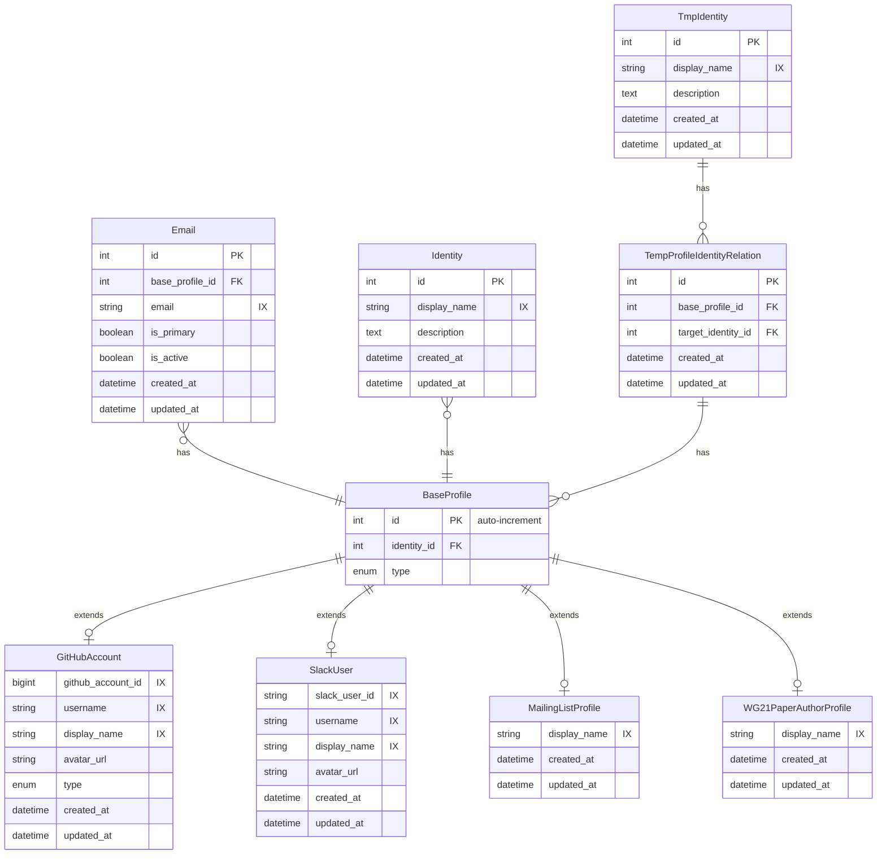

**Note:** Each extended table has `id` as primary key and foreign key to `BaseProfile.id`. The value is the same: one auto-increment in BaseProfile, and that same id is stored in exactly one extended profile row. Other tables (e.g. GitCommit, Issue) reference the profile via this single `id`.

**Note:** The **Email** table references BaseProfile via `base_profile_id` (FK to `BaseProfile.id`). One profile can have multiple email addresses; `is_primary` marks the primary email; `is_active` indicates whether the email is currently active. Other tables (e.g. MailingListMessage) can link to a profile via Email. **Note:** The `email` field is **not unique**; the same email address may appear in multiple rows (e.g. for different profiles or over time).

**Note:** The `type` field is a PostgreSQL enum (or equivalent) with values: `github`, `slack`, `mailing_list`, `wg21`. It identifies which extended table the row belongs to.

**Note:** In **GitHubAccount**, the `type` field is an enum with values: `user`, `organization`, `enterprise` (identifies whether the GitHub account is a user, organization, or enterprise).

**Note:** **BaseProfile** references **Identity** via `identity_id` (FK to Identity.id). One identity can have multiple BaseProfiles (e.g. one person with GitHub and Slack). **Identity**, **TmpIdentity**, and **TempProfileIdentityRelation** are used by the CPPA User Tracker: Identity holds the canonical user/account; TmpIdentity and TempProfileIdentityRelation stage temporary profile-to-identity relations (e.g. `base_profile_id`, `target_identity_id`) before merging.

### 2. GitHub Activity Tracker

#### Part 1: GitHub Account and Repository

**GitHubRepository** is the base table with all repository fields. GitHubAccount owns GitHubRepository; RepoLanguage and RepoLicense reference the repository.

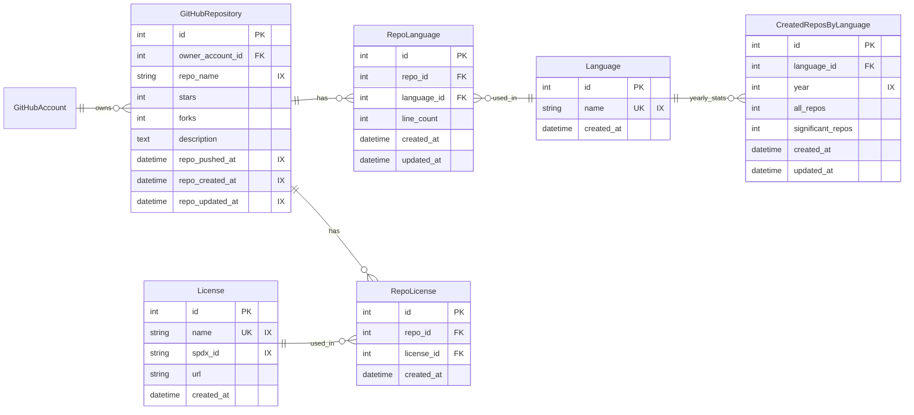

**Note:** **GitHubRepository** is the base table with all repository fields.

**Note:** Composite unique constraints should be applied on: (`owner_account_id`, `repo_name`) in GitHubRepository, (`repo_id`, `language_id`) in RepoLanguage, (`repo_id`, `license_id`) in RepoLicense, (`language_id`, `year`) in CreatedReposByLanguage.

#### Part 2: Git Commit and Issues

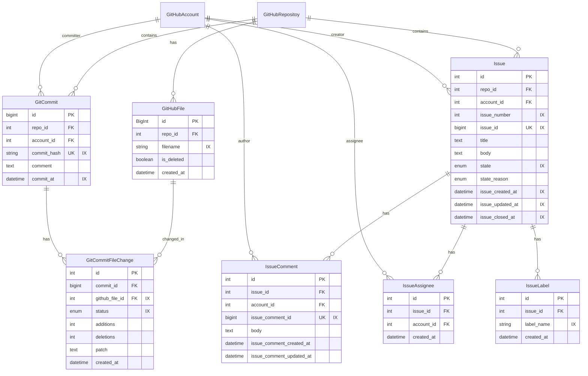

**Note:** Enum types:

- `GitCommitFileChange.status`: `file_change_status` enum with values: `added`, `modified`, `removed`, `renamed`, `copied`, `changed`
- `Issue.state`: `issue_state` enum with values: `open`, `closed`
- `Issue.state_reason`: `issue_state_reason` enum with values: `completed`, `not_planned`, `reopened`, `null`

**Note:** Composite unique constraints should be applied on: (`repo_id`, `commit_hash`) in GitCommit, (`commit_id`, `github_file_id`) in GitCommitFileChange, (`repo_id`, `issue_number`) in Issue, (`issue_id`, `account_id`) in IssueAssignee, (`issue_id`, `label_name`) in IssueLabel.

#### Part 3: Pull Requests

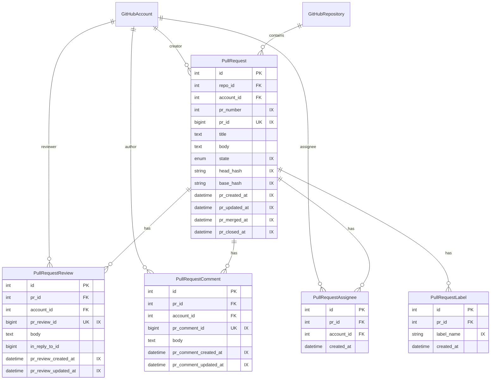

**Note:** Enum types:

- `PullRequest.state`: `pull_request_state` enum with values: `open`, `closed`, `merged`

**Note:** Composite unique constraints should be applied on: (`repo_id`, `pr_number`) in PullRequest, (`pr_id`, `account_id`) in PullRequestAssignee, (`pr_id`, `label_name`) in PullRequestLabel.

---

### 3. Boost Library Tracker

#### Part 1: Boost Library, Headers, and Dependencies

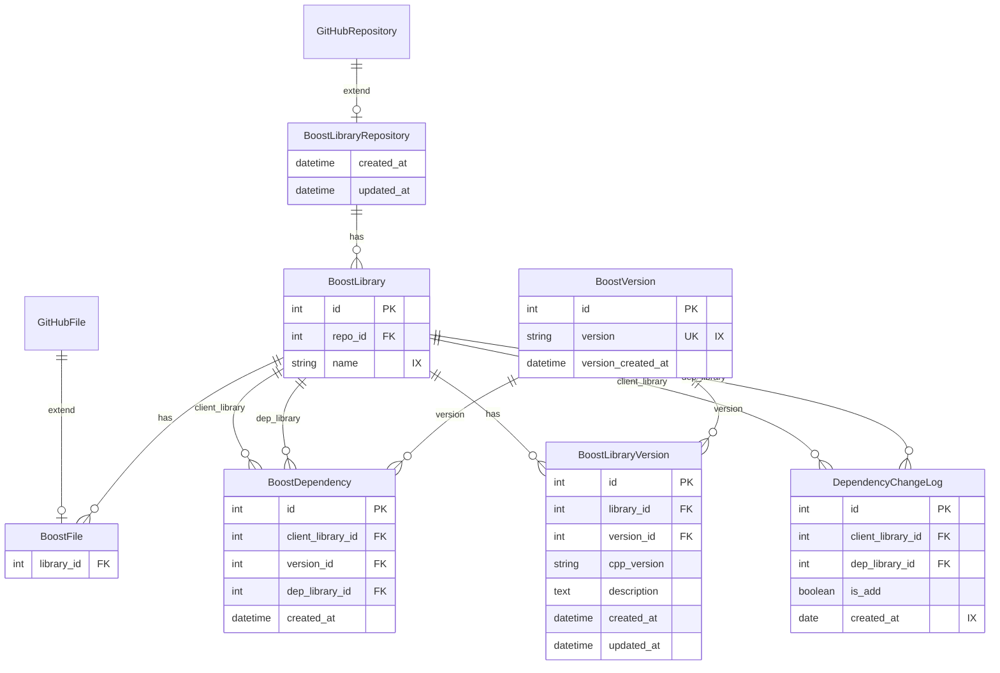

**Note:** **BoostLibraryRepository** extends **GitHubRepository** and adds `created_at`, `updated_at` (and any other app-specific fields); it inherits all repository fields from GitHubRepository.

**Note:** `BoostFile` extends `GitHubFile` and only adds `library_id` (inherits `id`, `repo_id`, `filename`, `created_at`, `is_deleted` from GitHubFile).

**Note:** Composite unique constraints should be applied on: (`library_id`, `version_id`) in BoostLibraryVersion, (`client_library_id`, `version_id`, `dep_library_id`) in BoostDependency, (`client_library_id`, `dep_library_id`, `created_at`) in DependencyChangeLog.

#### Part 2: Boost Library Versions, Maintainers, Authors, and Categories

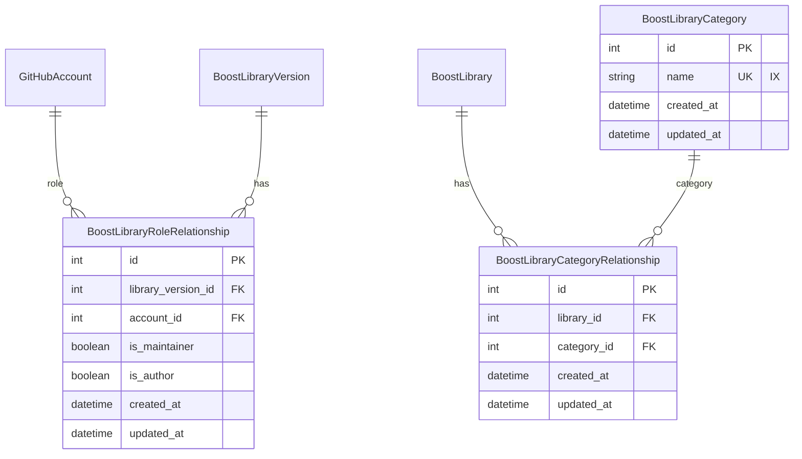

**Note:** Composite unique constraints should be applied on: (`library_version_id`, `account_id`) in BoostLibraryRoleRelationship, (`library_id`, `category_id`) in BoostLibraryCategoryRelationship.

---

### 4. Boost Usage Tracker

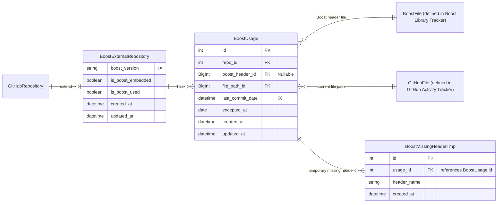

**Note:** `BoostMissingHeaderTmp` temporarily stores usage history when the Boost include path (`header_name`) does not yet exist in the Boost/GitHub file tables (e.g. `BoostFile` or `GitHubFile`). `usage_id` references `BoostUsage.id`. Once the header is added to the catalog, these records can be processed (e.g. backfilled into `BoostUsage` with a resolved `boost_header_id`) and optionally removed.

**Note:** `BoostExternalRepository` extends `GitHubRepository` and only adds `boost_version`, `is_boost_embedded`, `is_boost_used`, `created_at`, `updated_at`. Repository identity and metadata (e.g. `owner`, `repo_name`, `stars`, `forks`, `description`, `repo_pushed_at`, `repo_created_at`, `repo_updated_at`) are inherited from GitHubRepository.

**Note:** `BoostUsage` links each external repository to a Boost header file and to the file path where it is used: `boost_header_id` references `BoostFile` (defined in Boost Library Tracker; extends `GitHubFile`, only adds `library_id`) for the Boost header; `file_path_id` references `GitHubFile` (defined in GitHub Activity Tracker) for the current file path in that repo. This tracks which external repos use which Boost files and in which files they appear.

**Note:** A composite unique constraint should be applied on (`repo_id`, `boost_header_id`, `file_path_id`) in BoostUsage.

**Note:** `BoostMissingHeaderTmp.usage_id` references `BoostUsage.id` (FK). Consider an index on `usage_id` and on `header_name` for lookups and backfill.

---

### 5. Boost Mailing List Tracker

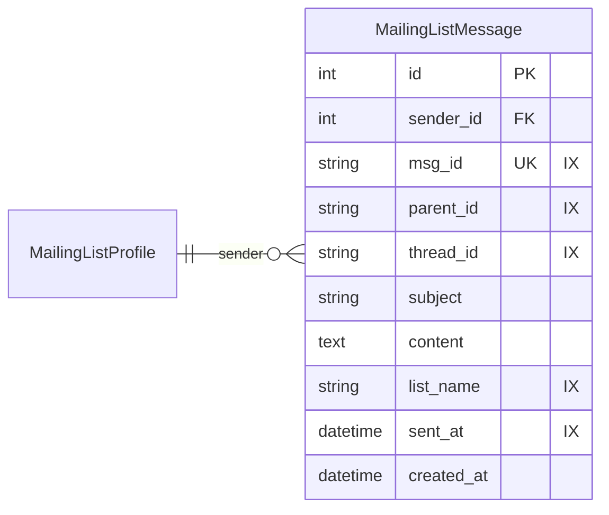

**Note:** `MailingListProfile` extends `BaseProfile` (section 1) and represents the mailing list user/account. `sender_id` in MailingListMessage references this profile.

---

### 6. Slack Activity Tracker

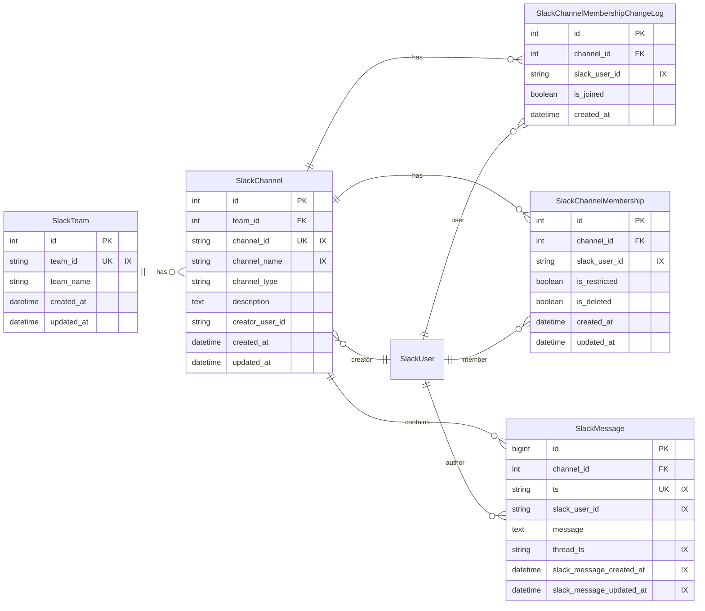

**Note:** **SlackUser** extends `BaseProfile` (section 1). SlackMessage, SlackChannelMembership, and SlackChannelMembershipChangeLog reference users via `slack_user_id`; SlackChannel references the channel creator (SlackUser) via `creator_user_id`.

**Note:** Composite unique constraints should be applied on: (`channel_id`, `ts`) in SlackMessage, (`channel_id`, `slack_user_id`, `created_at`) in SlackChannelMembershipChangeLog, (`channel_id`, `slack_user_id`) in SlackChannelMembership.

---

### 7. WG21 Papers Tracker

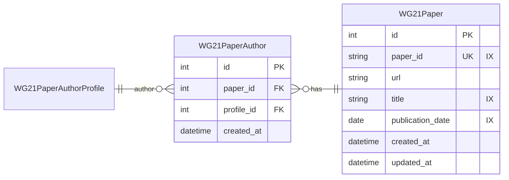

**Note:** **WG21PaperAuthorProfile** extends `BaseProfile` (section 1). `profile_id` in WG21PaperAuthor references this profile; each paper can have multiple authors.

**Note:** Composite unique constraint should be applied on (`paper_id`, `profile_id`) in WG21PaperAuthor.

---

### 8. Boost Website Analytics Tracker

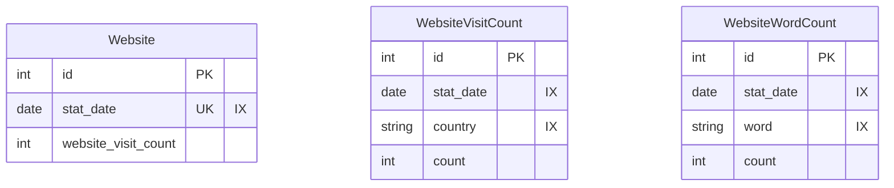

**Note:** **Website** stores daily site visit totals by `stat_date`. **WebsiteVisitCount** and **WebsiteWordCount** store per-country and per-word statistics; both reference the same `stat_date` for aggregation.

**Note:** Composite unique constraints should be applied on: (`stat_date`, `country`) in WebsiteVisitCount, (`stat_date`, `word`) in WebsiteWordCount.

---

### 9. CPPA Pinecone Sync

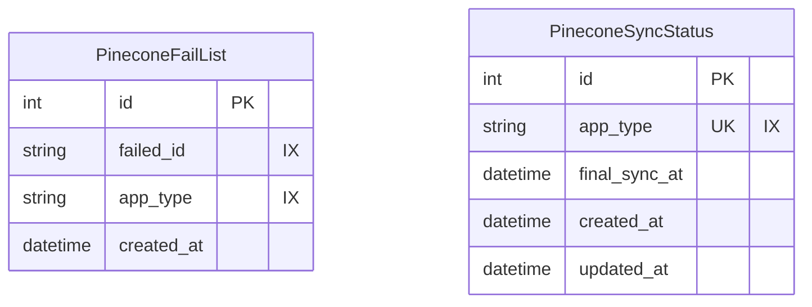

**Note:** **PineconeFailList** - Records failed sync operations by `failed_id` and `app_type` for retry or audit.

**Note:** **PineconeSyncStatus** - Tracks the last successful sync per app. One row per `app_type`. `final_sync_at` is when the last sync for that type completed; `created_at` and `updated_at` are for the row.

---

## Appendix

### Appendix A: Table summary

| Table                                | Description                                                                                              | Section |
| ------------------------------------ | -------------------------------------------------------------------------------------------------------- | ------- |
| **BaseProfile**                      | Base table for profiles; extended by platform-specific profile tables. Has `identity_id` FK to Identity. | 1       |
| **Identity**                         | Top-level user/account; one identity can have multiple BaseProfiles.                                     | 1       |
| **Email**                            | Email addresses linked to BaseProfile (one profile, many emails).                                        | 1       |
| **GitHubAccount**                    | Profile for GitHub (user/org/enterprise); extends BaseProfile.                                           | 1       |
| **SlackUser**                        | Profile for Slack; extends BaseProfile.                                                                  | 1       |
| **MailingListProfile**               | Profile for mailing list; extends BaseProfile.                                                           | 1       |
| **WG21PaperAuthorProfile**           | Profile for WG21 paper authors; extends BaseProfile.                                                     | 1       |
| **TmpIdentity**                      | Temporary identity for staging (CPPA User Tracker).                                                      | 1       |
| **TempProfileIdentityRelation**      | Staging table: base_profile_id -> target_identity_id (CPPA User Tracker).                                | 1       |
| **GitHubRepository**                 | Repository metadata (owner, repo_name, stars, forks, etc.). Base table for repo subtypes.                | 2       |
| **GitHubFile**                       | File in a repo (filename, repo_id, is_deleted). Base for file subtypes.                                  | 2       |
| **Language**                         | Reference: language name.                                                                                | 2       |
| **CreatedReposByLanguage**           | Yearly repository counts by language (`all_repos`, `significant_repos`; unique on `language_id + year`). | 2       |
| **License**                          | Reference: license name, spdx_id, url.                                                                   | 2       |
| **RepoLanguage**                     | Repo-language link with line_count.                                                                      | 2       |
| **RepoLicense**                      | Repo-license link.                                                                                       | 2       |
| **GitCommit**                        | Commit in a repo (hash, committer, comment, commit_at).                                                  | 2       |
| **GitCommitFileChange**              | Per-commit file change (links commit, GitHubFile, status, additions, deletions, patch).                  | 2       |
| **Issue**                            | GitHub issue (repo, creator, number, title, body, state, labels, assignees).                             | 2       |
| **IssueComment**                     | Comment on an issue.                                                                                     | 2       |
| **IssueAssignee**                    | Issue-assignee link.                                                                                     | 2       |
| **IssueLabel**                       | Issue-label name.                                                                                        | 2       |
| **PullRequest**                      | PR (repo, creator, number, title, body, state, head_hash, base_hash, dates).                             | 2       |
| **PullRequestReview**                | Review on a PR.                                                                                          | 2       |
| **PullRequestComment**               | Comment on a PR.                                                                                         | 2       |
| **PullRequestAssignee**              | PR-assignee link.                                                                                        | 2       |
| **PullRequestLabel**                 | PR-label name.                                                                                           | 2       |
| **BoostLibraryRepository**           | Extends GitHubRepository; adds created_at, updated_at (Boost repos).                                     | 3       |
| **BoostLibrary**                     | Library within a Boost repo (name).                                                                      | 3       |
| **BoostFile**                        | Extends GitHubFile; adds library_id (file in a Boost library).                                           | 3       |
| **BoostVersion**                     | Reference: Boost version string.                                                                         | 3       |
| **BoostLibraryVersion**              | Library-version link (cpp_version, description).                                                         | 3       |
| **BoostDependency**                  | Library dependency (client_library, version, dep_library).                                               | 3       |
| **DependencyChangeLog**              | Log of dependency add/remove (client_library, dep_library, is_add, created_at).                          | 3       |
| **BoostLibraryRoleRelationship**     | Library version-account link (maintainer/author).                                                        | 3       |
| **BoostLibraryCategory**             | Reference: category name.                                                                                | 3       |
| **BoostLibraryCategoryRelationship** | Library-category link.                                                                                   | 3       |
| **BoostExternalRepository**          | Extends GitHubRepository; adds boost_version, is_boost_embedded, is_boost_used.                          | 4       |
| **BoostUsage**                       | External repo use of Boost (repo, boost_header_id, file_path_id, last_commit_date).                      | 4       |
| **BoostMissingHeaderTmp**           | Temporary usage records when header_name is not yet in BoostFile/GitHubFile (usage_id→BoostUsage.id).   | 4       |
| **MailingListMessage**               | Mailing list message (sender_id->MailingListProfile, msg_id, subject, content, list_name, sent_at).      | 5       |
| **SlackTeam**                        | Slack workspace (team_id, team_name).                                                                    | 6       |
| **SlackChannel**                     | Channel in a team (channel_id, name, type, creator_user_id).                                             | 6       |
| **SlackMessage**                     | Message in a channel (ts, slack_user_id, message, thread_ts).                                            | 6       |
| **SlackChannelMembership**           | Channel-member link (slack_user_id, is_restricted, is_deleted).                                          | 6       |
| **SlackChannelMembershipChangeLog**  | Log of join/leave (slack_user_id, is_joined, created_at).                                                | 6       |
| **WG21Paper**                        | WG21 paper (paper_id, url, title, publication_date).                                                     | 7       |
| **WG21PaperAuthor**                  | Paper-author link (paper_id, profile_id->WG21PaperAuthorProfile).                                        | 7       |
| **Website**                          | Daily site visit total (stat_date, website_visit_count).                                                 | 8       |
| **WebsiteVisitCount**                | Per-date, per-country visit count.                                                                       | 8       |
| **WebsiteWordCount**                 | Per-date, per-word count.                                                                                | 8       |
| **PineconeFailList**                 | Failed sync records (failed_id, type) for retry/audit.                                                   | 9       |
| **PineconeSyncStatus**               | Last sync per type (type, final_sync_at, created_at, updated_at); type = slack, mailing list, wg21, etc. | 9       |

### Appendix B: Relationship summary

| From                        | To                                                                                                                     | Relationship                               |
| --------------------------- | ---------------------------------------------------------------------------------------------------------------------- | ------------------------------------------ |
| Identity                    | BaseProfile                                                                                                            | One identity has many profiles             |
| BaseProfile                 | Email                                                                                                                  | One profile has many emails                |
| BaseProfile                 | GitHubAccount, SlackUser, MailingListProfile, WG21PaperAuthorProfile                                                   | Extends (1:1 subtype)                      |
| TmpIdentity                 | TempProfileIdentityRelation                                                                                            | Has many (target)                          |
| TempProfileIdentityRelation | BaseProfile                                                                                                            | Has many (base_profile_id)                 |
| GitHubAccount                | GitHubRepository                                                                                                       | Owns many                                  |
| GitHubRepository             | RepoLanguage, RepoLicense                                                                                              | Has many                                   |
| Language                     | CreatedReposByLanguage                                                                                                 | Has many yearly stats                      |
| GitHubRepository             | BoostLibraryRepository, BoostExternalRepository                                                                        | Extends (1:1 subtype)                      |
| GitHubRepository             | GitCommit, Issue, PullRequest                                                                                          | Contains many                              |
| GitHubRepository             | GitHubFile                                                                                                             | Has many                                   |
| GitHubFile                   | BoostFile                                                                                                              | Extends (1:1 subtype)                      |
| GitHubFile                   | GitCommitFileChange                                                                                                    | Changed in (many file changes)             |
| GitCommit                    | GitCommitFileChange                                                                                                    | Has many                                   |
| Issue                        | IssueComment, IssueAssignee, IssueLabel                                                                                | Has many                                   |
| PullRequest                  | PullRequestReview, PullRequestComment, PullRequestAssignee, PullRequestLabel                                           | Has many                                   |
| GitHubAccount                | GitCommit, Issue, IssueComment, IssueAssignee, PullRequest, PullRequestReview, PullRequestComment, PullRequestAssignee | Committer/creator/author/assignee/reviewer |
| BoostLibraryRepository       | BoostLibrary                                                                                                           | Has many                                   |
| BoostLibrary                 | BoostFile, BoostDependency (client/dep), BoostLibraryVersion, DependencyChangeLog                                      | Has many                                   |
| BoostLibrary                 | BoostLibraryCategoryRelationship                                                                                       | Has many                                   |
| BoostVersion                 | BoostDependency, BoostLibraryVersion                                                                                   | Version                                    |
| BoostLibraryVersion          | BoostLibraryRoleRelationship                                                                                           | Has many                                   |
| GitHubAccount                | BoostLibraryRoleRelationship                                                                                           | Role (maintainer/author)                   |
| BoostLibraryCategory         | BoostLibraryCategoryRelationship                                                                                       | Category                                   |
| BoostExternalRepository      | BoostUsage                                                                                                             | Has many                                   |
| BoostUsage                   | BoostFile, GitHubFile                                                                                                  | References (boost header, file path)       |
| BoostUsage                   | BoostMissingHeaderTmp                                                                                                  | Has many (temporary missing-header records) |
| MailingListProfile           | MailingListMessage                                                                                                     | Sender (has many messages)                 |
| SlackTeam                    | SlackChannel                                                                                                           | Has many                                   |
| SlackChannel                 | SlackMessage, SlackChannelMembership, SlackChannelMembershipChangeLog                                                  | Contains / has many                        |
| SlackUser                    | SlackMessage, SlackChannelMembership, SlackChannelMembershipChangeLog                                                  | Author / member / user                     |
| SlackChannel                 | SlackUser                                                                                                              | Creator (many-to-one)                      |
| WG21PaperAuthorProfile       | WG21PaperAuthor                                                                                                        | Author (has many)                          |
| WG21Paper                    | WG21PaperAuthor                                                                                                        | Has many authors                           |
